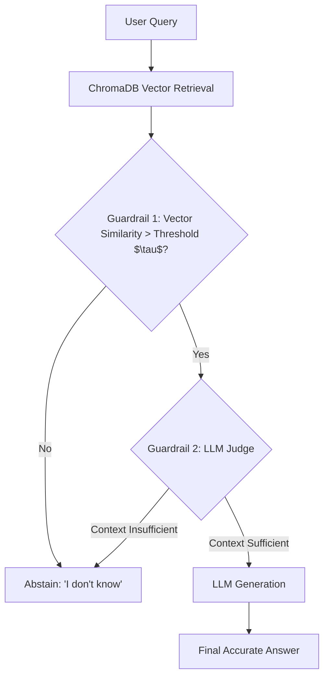

# 🤖 Confidence-Calibrated RAG for Answer Abstention


> **STAT GR5293 Generative AI using Large Language Models - Final Project**

This repository contains the implementation of a **Confidence-Calibrated Retrieval-Augmented Generation (RAG)** pipeline. Unlike naive RAG systems that hallucinate when context is missing, this system is equipped with a **Dual-Layered Abstention Guardrail** that mathematically calculates confidence and uses an LLM-as-a-judge to gracefully abstain ("I don't know") on out-of-domain queries.

---

## 🏗 Architecture

The system utilizes a dual-guardrail approach to prevent hallucinations:



## 🚀 Features
1. **Auto-Calibration Algorithm**: Dynamically calculates the optimal similarity threshold on startup based on a sample of in-domain and out-of-domain vectors.
2. **LLM-as-a-Judge**: A rigorous, temperature=0 LLM step that evaluates context adequacy before generating.
3. **DeepEval CI/CE**: Automated testing for `AnswerRelevancy` and `Faithfulness`.
4. **Interactive Streamlit Demo**: A beautiful web UI with toggleable guardrails for ablation testing.

---

## 🛠 Setup & Installation

**1. Clone the repository and install dependencies:**
```bash
git clone https://github.com/yourusername/confidence-calibrated-rag.git
cd confidence-calibrated-rag
pip install -r requirements.txt
```

**2. Set up your environment variables:**
```bash
export OPENAI_API_KEY="sk-your-api-key"
```

## 💻 Running the Application

**Run the interactive Streamlit Web UI:**
```bash
streamlit run src/app.py
```
*Toggle the "Enable Abstention Guardrails" on the sidebar to compare Calibrated vs Naive RAG.*

**Run the CLI Demo:**
```bash
python src/demo.py
python src/demo.py --naive  # Runs without guardrails to demonstrate hallucinations
```

## 🧪 Evaluation (DeepEval)

We use DeepEval for continuous evaluation. To run the automated RAG Triad test suite (Faithfulness, Answer Relevancy, and Abstention Logic):

```bash
deepeval test run src/evaluate.py
```

## 📂 Repository Structure

```text
├── data/
│   ├── corpus.txt           # The curated knowledge base (Tech & Finance)
│   └── eval_dataset.json    # Test cases mapped to in-domain/out-of-domain
├── src/
│   ├── app.py               # Streamlit web application
│   ├── build_dataset.py     # Script to generate the corpus and eval data
│   ├── demo.py              # Command-line interface demo
│   ├── evaluate.py          # DeepEval CI/CE test suite
│   └── rag.py               # Core ConfidenceCalibratedRAG class & logic
├── Final_Report.md          # Comprehensive academic report
├── README.md                # This file
└── requirements.txt         # Dependencies
```

## 👥 Contributors
- **Rhein** - Columbia University (STAT GR5293)
- **Teammate** - Columbia University (STAT GR5293)
