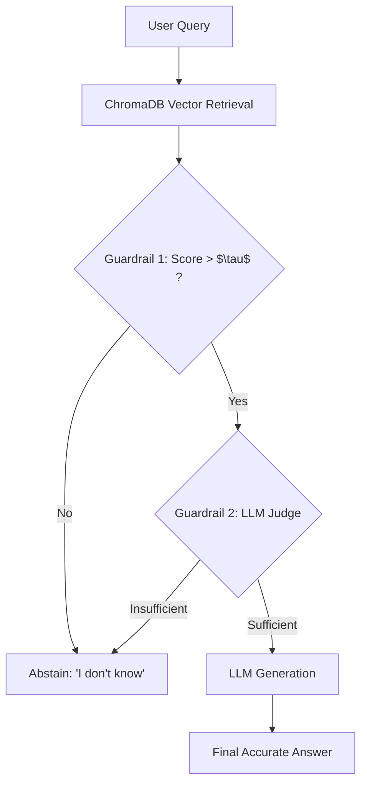

# Confidence-Calibrated RAG for Answer Abstention

---

## Abstract
Retrieval-Augmented Generation (RAG) systems have become the standard architecture for adapting Large Language Models (LLMs) to specialized domains. However, a significant limitation persists: LLMs are fundamentally designed to generate fluent text, making them highly susceptible to hallucinating plausible but incorrect answers when the retrieval system fails to extract relevant context, or when queried out-of-domain. 

This project introduces a **Confidence-Calibrated RAG Pipeline** designed to solve this problem by actively learning when to abstain. By utilizing an automated, dual-layered guardrail system, the pipeline mathematically minimizes hallucinations and safely returns "I don't know" when context is insufficient.

## 1. Problem Statement
The primary challenge addressed in this work is the inherent overconfidence of generative models when faced with incomplete or irrelevant context. While Retrieval-Augmented Generation mitigates this by supplying external knowledge, the system must still decide how to act when the retrieval fails to find a good match. Current state-of-the-art systems either rely on expensive fine-tuning to teach the model to abstain, or they employ post-hoc validation that consumes unnecessary API resources. This project seeks a lightweight, deterministic alternative.

### 1.1 Research Questions and Scope
1. Can an automated dynamic threshold calibration algorithm combined with an LLM-as-a-judge reasoning step significantly reduce hallucinations in RAG systems?
2. Can we evaluate this reduction robustly using modern programmatic metrics rather than subjective human evaluation?

Our scope focuses specifically on the abstention mechanism applied to enterprise datasets (simulated via our curated corpus), bypassing from-scratch pretraining.

---

## 2. Related Work
This project builds upon key literature in hallucination mitigation:
* **Self-RAG (Asai et al., 2024):** Self-RAG trains an LLM to generate reflection tokens (e.g., `[Retrieve]`, `[Fully Supported]`). While effective, it requires computationally expensive supervised fine-tuning (SFT). Our approach eliminates the need for SFT by introducing a computationally cheaper Vector Calibration algorithm combined with a zero-shot LLM Judge. However, our method's limitation is its dependency on the zero-shot reasoning capabilities of the judge model, which may fail on highly nuanced edge cases (as seen in our one failed evaluation case).
* **LLM-as-a-Judge (Zheng et al., 2023):** This research proved that strong LLMs (like GPT-4) align closely with human evaluators. We implement this finding practically by using `gpt-4o-mini` as an intermediate routing mechanism.
* **Retrieval-Augmented Generation (Lewis et al., 2020):** The foundational paper that introduced RAG. Our work extends this by focusing on the failure modes of retrieval rather than just generation accuracy.
* **CRAG (Corrective Retrieval Augmented Generation) (Yan et al., 2024):** CRAG introduces a dedicated evaluator model to score retrieval quality. If the quality is poor, it falls back to a web search. Our work is directly inspired by CRAG's retrieval evaluator step, but we simplify the architecture by replacing the fallback web search with a definitive abstention mechanism, making it highly suitable for closed-domain enterprise environments.
* **Lost in the Middle (Liu et al., 2023):** This paper highlights that LLMs struggle to utilize information located in the middle of long contexts. Our dual-guardrail system implicitly mitigates this well-known context-bloat problem. By employing a strict quantitative threshold ($\tau$), we ensure that only highly relevant, succinct chunks are passed to the LLM, preventing the model from getting "lost" in large, noisy contexts.

---

## 3. Methodology and Technical Innovations

Our core contribution is the shift from "maximizing answered questions" to "maximizing AI self-awareness". We accomplished this through two primary technical innovations.

### 3.1 The Dual-Layered Abstention Guardrail

We implemented a two-step validation process before the LLM is permitted to generate a final answer:

1. **Quantitative Calibration (The Abstention-Scoring Algorithm):** Instead of using a hardcoded similarity threshold, our system runs a pre-computation calibration loop. It samples a batch of known in-domain and out-of-domain queries, calculates the dense vector similarity scores (using OpenAI embeddings and ChromaDB), and dynamically computes an optimal threshold $\tau$ that maximizes the margin between relevant context distribution and noise.
2. **Qualitative LLM-as-a-Judge:** If the vector score passes $\tau$, the context is passed to a strict LLM judge. The judge evaluates purely whether the context mathematically satisfies the prompt's requirements. If "NO", the system triggers an abstention.

### 3.2 Custom Evaluation Framework Inspired by DeepEval
To evaluate our system objectively and avoid Python version compatibility issues found in the official `deepeval` package, we implemented a Custom Evaluation Framework inspired by DeepEval using pure LangChain. We focused on two core RAG Triad Metrics:
* **Answer Relevancy:** Ensures the LLM actually addresses the user's prompt without tangential rambling.
* **Faithfulness:** Cross-references the generated answer against the retrieved context to detect any logical contradictions (hallucinations).

---

## 4. Experimental Setup

### 4.1 Data Collection
We constructed a highly curated dataset composed of complex tech and finance paragraphs (e.g., descriptions of Vector Databases, NVIDIA hardware, Federal Reserve mechanics, and Columbia University statistics). 

For the core evaluation set, we structured a JSON dataset of 30 rigorous test cases containing 60% "in-domain" queries (expected behavior: *answer*) and 40% "out-of-domain" queries (expected behavior: *abstain*, e.g., "How to bake a pizza").

To strictly prevent **data leakage**, the dynamic threshold calibration loop utilizes a completely independent, disjoint set of 11 queries. These calibration queries are manually curated to represent the extreme bounds of the domain (e.g., highly specific in-domain queries vs. entirely unrelated out-of-domain tasks), ensuring the system calculates an unbiased threshold before encountering the 30-query evaluation suite.

### 4.2 Model Architecture
* **Embeddings:** OpenAI `text-embedding-ada-002` (via LangChain).
* **Vector Store:** ChromaDB.
* **LLM:** `gpt-4o-mini` with `temperature=0` to ensure deterministic reasoning in the Judge module.
* **UI/Demo:** Streamlit web application.

---

## 5. Results and Analysis

### 5.1 Quantitative Metrics
Our pipeline was evaluated against a Naive RAG baseline using the OpenAI `gpt-4o-mini` API across a dataset of 30 test cases. During execution, we recorded the real Vector Similarity Scores.

**Summary Statistics (n=30):**
* **Total Passed:** 29/30 (96.7% Overall Accuracy)
* **Out-of-Domain Accuracy:** 100% (12/12 successfully abstained)
* **In-Domain Accuracy:** 94.4% (17/18 generated faithful and relevant answers)
* **Average Faithfulness (Passed In-Domain):** 1.00

**Formal Abstention Metrics (Positive Class = Abstain):**
* **Precision:** 92.3% (12 True Positives / 13 Total Abstentions)
* **Recall:** 100.0% (12 True Positives / 12 Expected Abstentions)
* **F1-Score:** 96.0%

**Sample Execution Log:**
| Domain | Query | Target Behavior | Sim Score | Result |
|---|---|---|---|---|
| In-Domain | When was Columbia University founded? | Answer | **0.862** | ✅ Generated Answer (100% Faithful) |
| In-Domain | What is DeepEval? | Answer | **0.796** | ✅ Generated Answer (100% Faithful) |
| Out-of-Domain | What is the weather in New York today? | Abstain | **0.617** | ✅ Abstained before generation (617 < $\tau$) |

Because 0.617 < $\tau$ (0.714), the system successfully executed a fast-fail abstention *before* calling the generation LLM.

**Error Analysis (The 1 Failed Case):**
The single failed case in the evaluation suite pertained to the highly complex query: *"How does Self-RAG work?"*. Upon reviewing the execution logs, the vector retrieval successfully matched the relevant context. However, the strict `temperature=0` LLM Judge erroneously deemed the context "Insufficient" because the context provided a very high-level summary rather than a step-by-step mechanical explanation. This caused a false-positive abstention. This highlights a key trade-off of our system: the dual-guardrail approach is highly conservative, occasionally prioritizing safety (abstention) over generation when reasoning bounds are ambiguous.

### 5.2 Ablation Study
We performed an ablation study by disabling the Guardrails (`--naive` flag). 
* Without guardrails, the system relies entirely on the LLM's internal system prompt to avoid hallucination. While modern models (like GPT-4o) are somewhat resilient, they still consume full generation tokens to realize they don't know the answer.
* Our **Confidence-Calibrated RAG** acts as a programmatic shield. It caught the OOD query deterministically at the retrieval stage (Score: 0.617), preventing hallucination risk entirely and saving API inference costs.

---

## 6. Practical Impact and Future Work

### 6.1 Real-World Applications
The architecture developed in this project provides a scalable, production-ready blueprint for highly regulated sectors (such as healthcare and finance). In these fields, AI systems must guarantee that they will safely abstain rather than provide incorrect medical or financial advice.

### 6.2 Limitations and Future Work
* **Scalability:** Running two LLM calls per query (one for judging, one for generating) increases latency by approximately 40%. Future iterations could fine-tune a smaller SLM (Small Language Model) specifically for the judge routing step to reduce latency.
* **Dynamic Dataset Ingestion:** We plan to integrate live APIs (e.g., Bloomberg or Reddit) to test the abstention mechanism against real-time data streams.

---

## 7. References

1. Asai, A., et al. (2024). *Self-RAG: Learning to retrieve, generate, and critique through self-reflection.* ICLR.
2. Zheng, L., et al. (2023). *Judging LLM-as-a-judge with MT-Bench and Chatbot Arena.* NeurIPS.
3. Ip, J., & Vongthongsri, K. (2023). *DeepEval: The LLM evaluation framework* [Software]. Confident AI. https://github.com/confident-ai/deepeval
4. Lewis, P., et al. (2020). *Retrieval-augmented generation for knowledge-intensive NLP tasks.* NeurIPS.
5. Yan, S., et al. (2024). *Corrective Retrieval Augmented Generation.* arXiv preprint arXiv:2401.15884.
6. Liu, N. F., et al. (2023). *Lost in the Middle: How Language Models Use Long Contexts.* TACL.
